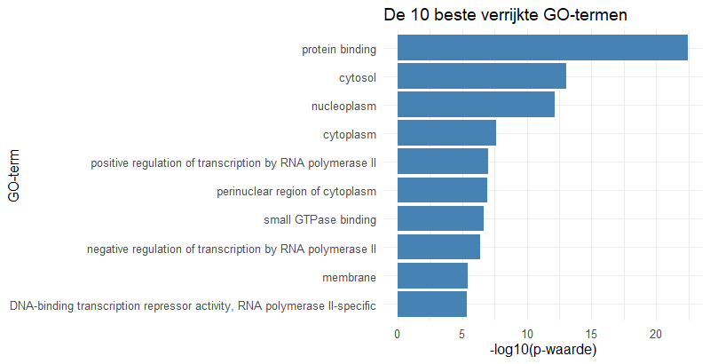
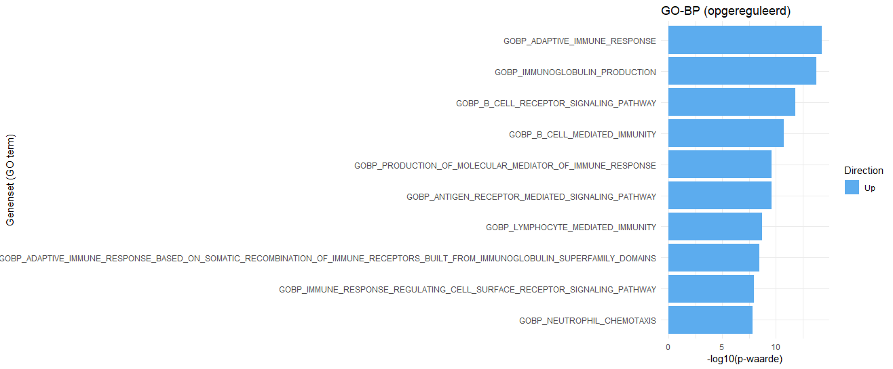
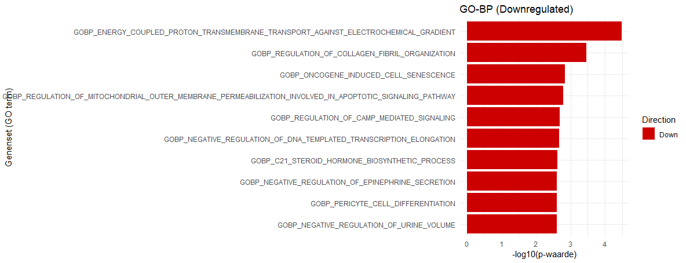

# Reumatoide-artritis-BM2C
Verslag over data-analyse van Reumatoide artritis
Autheur: Gabriel de Vivo
klas: BM2C

## 📁 Inhoud/structuur
- `data/ruw/` - de orginele dataset
- `data/` – de verwerkte data die is gebruikt.  
- `data/bambambai/` - bam en bambai files die zijn gemaakt
- `code/` – gebruikte code om de gekregen data te verwerken
- `figuren/` - grafieken en tabellen
- `bronnen/` - gebruikte bronnen 
- `README.md` - het verslag

---

## Introductie

Reumatoide Artritis is een vorm van gewrichtsslijmvlies ontsteking waarbij het immuun systeem lichaamseigen weefsels aantast in de gewrichten[(Andrei-Flavius Radu, 2021)](bronnen/cells-10-02857-v2.pdf). Deze auto-immuun ziekte ontstaat in 0.24-1% van de populatie en komt 2 tot 3 keer meer voor in vrouwen dan bij mannen[(Venetsanpoulou et al, 2023)](bronnen/cells-10-02857-v2.pdf). De symptonen van Reumatoide Artritis omvatten pijn in de aangetaste gewrichte en stijfheid in deze gewrichten na langdurig stil zitten[(Jutley et al, 2017)](bronnen/1-s2.0-S1521694217300335-main.pdf). Reumatoide artritis wordt veroorzaakt door een combinatie van genetica en een auto-immuun reactie op, bijvoorbeeld lichaams eigen eiwitten[(Wang et al, 2004)](bronnen/roehrl-wang-glycosaminoglycans-are-a-potential-cause-of-rheumatoid-arthritis.pdf). Omdat er bekende indicatoren zijn voor het ontstaan van reumatoide artritis, zoals reumatoide factor[(Jutley et al, 2017)](bronnen/1-s2.0-S1521694217300335-main.pdf). Daarom is het van groot interesse om ook te kijken naar genetische indicatoren van reumatoide artritis, een bekende genetische indicator van reumatoide artritis is HLA-DRB1[(Laura E. Dedmon, 2020)](bronnen/keaa232.pdf). Omdat er al genen genetische indicatoren zijn gevonden is het van interesse om meer genen te vinden, de hoofdvraag van dit onderzoek is daarom; Welke genen hebben een afwijkende expressie in patienten met rheumatoide artritis vergeleken met gezonde patienten? 

## Methoden

Om de ruwe [data](data/ruw/) te verwerken is gebruik gemaakt van verscheidenen packages in het [R script](code/script-transcriptionomics.R). 
Voor het mappen van de reads is gebruik gemaakt van Rsubread versie xxxxx[(Liao et al, 2019)](bronnen/Yang_Liao_2019.pdf). Het Rsubread package zoekt de locatie van bepaalde sequenties van het gesequencete DNA op het volledige genoom van de mens en maakt hiermee een bam file. Deze bam files worden in een countmatrix gezet. 
Na het mappen van de samples zijn de gemapte samples genormaliseert met DEseq2 versie xxxxxx [(Love et al, 2014)](https://bioconductor.org/packages/release/bioc/html/DESeq2.html). De data wordt genormaliseert om rekening te houden met de sequencing depth en kan door deze normalisering de expressie beter vergelijken tussen samples.
Na het normaliseren van de samples kan de data worden gevisualiseert met de package EnhancedVolcano. Met deze package kan een grafiek worden gemaakt die de differentiele expressie van de samples weergeeft.
Verder zijn de samples geanalyseert met goseq om een Go enrichment uit te voeren, Voor deze analyse wordt gebruik gemaakt van het menselijke HG38 genoom. De goenrichment laat genen zien in een grafiek die een verhoogde expressie hebben in de patienten samples.
Om de pathway analyse te doen is gebruik gemaakt van de [KEGGREST](https://www.bioconductor.org/packages/release/bioc/html/KEGGREST.html) package, Deze package mapt de gesequencete DNA op bekende pathways om te kijken welke pathways mogelijk betrokken zijn bij reumatoide artritis.

## Resultaten

Om de overexpressie van genen in de patienten te analyseren is gebruik gemaakt van verscheidenen packages in R.
De data is verwerkt met Rsubread om een [countmatrix](data/count_matrix.txt) te maken met de bam en bambai [files](data/bambambai/).

  

*Figuur 2: enhanced volcano plot met p-cutoff, de x-as geeft de foldchange aan en de punten die op be y-as boven 5 liggen zijn significant, aangegeven met een rode kleur. de grijs gekleurde bolletjes verschillen niet significant van de patienten.*

Na het maken van de [countmatrix](data/count_matrix.txt) wordt de data vergeleken met elkaar. Dit is te zien in figuur 2 waar een volcano plot is weergegeven, in deze grafiek is te zien dat verscheidenen genen significant up of down regulated zijn. een opvallend voorbeeld hiervan is het ANKRD30BL, dit gen is erg significant downregulated in patienten. De volcano plot bevat 2085 significant upregulated genen en 2487 significant downregulated genen.

  
 
 
 
*Figuur 2: GOenrichment grafiek van de patienten. De x-as geeft de significantie in -log10 aan.*

De 10 meest significante genen zijn verwerkt in figuur 3, waarbij de "protein binding" het meest significant was. De overige significante genen zien [hier](data/GO_enrichment_significant.csv) te vinden. 

  

*Figuur 4: Pathway analyse van de upregulated pathways, de x-as geeft de significantie van de pathways in -log10 aan.*

Figuur 4 en 5 geven de 10 hoogste upregulated en downregulated pathways aan in de patienten. 

  

*Figuur 5: Pathway analyse van de down regulated pathways, de x-as geeft de significantie van de pathways in -log10 aan.*

## Conclusie

Spreuken met meer accuraatheid lijken minder krachtig te zijn. Een uitzondering op deze trend is de onvergeeflijke vloek *Avada Kedavra*, welke beter niet gebruikt kan worden. 

